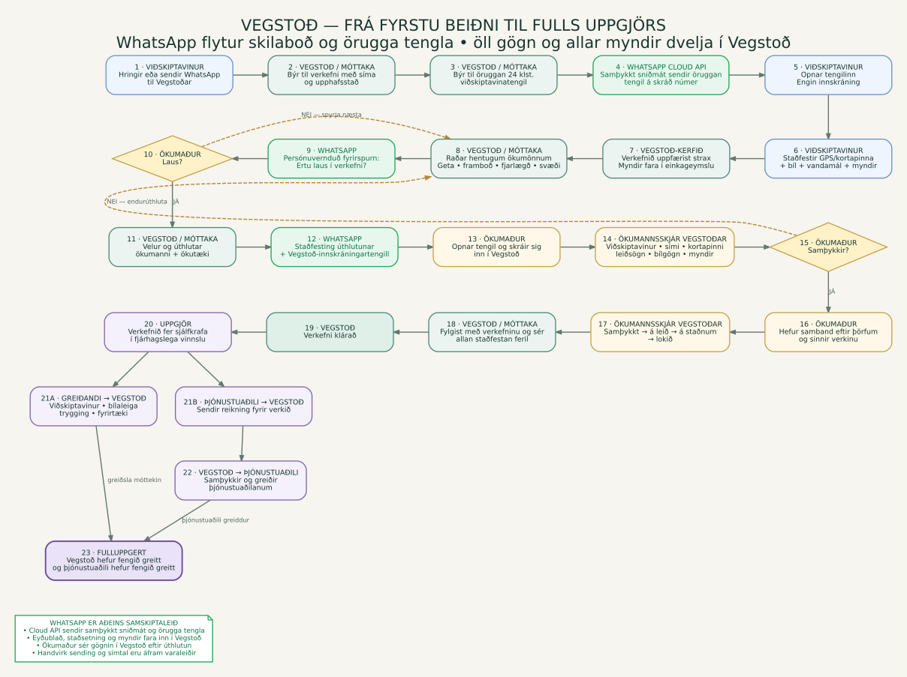

# Vegstoð — heildarferli kerfisins

[Opna flæðiritið eitt og sér](assets/vegstod-system-flowchart.svg) · [Sækja PNG-mynd](assets/vegstod-system-flowchart.png)

## Hlutverk WhatsApp

WhatsApp er samskiptaleiðin utan um Vegstoð, en ekki geymslustaður verkefnisins. Það kemur þrisvar inn í flæðið:

1. Móttaka sendir viðskiptavininum öruggan Vegstoð-tengil í WhatsApp.
2. Móttaka sendir hentugum ökumanni stutta, persónuverndaða fyrirspurn um framboð í WhatsApp.
3. Eftir úthlutun sendir móttaka ökumanninum staðfestingu og innskráningartengil á Vegstoð í WhatsApp.

Viðskiptavinurinn setur staðsetningu, bílgögn, lýsingu og myndir **inn í Vegstoð**. Myndirnar eru í einkageymslu Supabase og fara ekki í gegnum WhatsApp. Úthlutaður ökumaður skráir sig inn á Vegstoð og sér þar nákvæman kortapinna, upplýsingar um viðskiptavin, bílgögn og heimilaðar myndir.

Móttaka yfirfer alltaf tilbúin WhatsApp-skilaboð og ýtir sjálf á **Senda**. Vegstoð notar því ekki greitt WhatsApp Business API og getur ekki fullyrt að ytri skilaboð hafi verið send, lesin eða þeim svarað.

## Staða miðað við núverandi byggingu

- Viðskiptavinaflæðið er tengt beint við WhatsApp: þegar öruggi tengillinn hefur verið búinn til opnar **Senda í WhatsApp** skráða númer viðskiptavinarins með einföldum leiðbeiningum á ensku og tenglinum. Engin afritun og líming er nauðsynleg.
- Ökumannsflæðið er einnig tengt beint við WhatsApp: framboðsfyrirspurn og úthlutunar-/innskráningartengill opnast með tilbúnum texta.
- Í öllum tilvikum fer móttaka yfir textann og ýtir sjálf á **Senda** í WhatsApp. Gögn og myndir eru áfram inni í Vegstoð.

## Greiðsluflæðið

Greiðandinn greiðir alltaf Vegstoð. Greiðandinn getur verið viðskiptavinurinn, bílaleiga, trygginga-/aðstoðarfélag eða fyrirtæki. Þjónustuaðilinn sendir sinn reikning til Vegstoðar og Vegstoð greiðir honum sérstaklega. Málið telst **fulluppgert** fyrst þegar báðir leggir eru greiddir.
